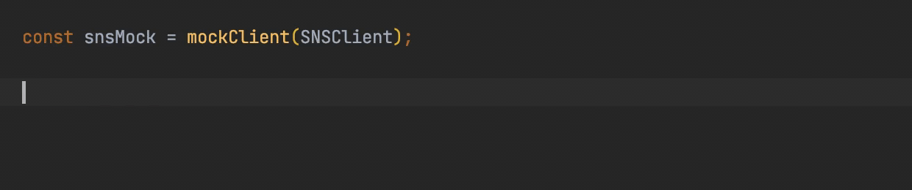

<div align="center">

# AWS SDK v3 Client mock

Easy and powerful mocking of AWS SDK v3 Clients.

[](https://www.npmjs.com/package/aws-sdk-client-mock)
[](https://github.com/m-radzikowski/aws-sdk-client-mock/actions?query=workflow%3ACI)
[](https://app.codecov.io/gh/m-radzikowski/aws-sdk-client-mock/)

</div>

Library recommended by the AWS SDK for JavaScript team - see the [introductory post on the AWS blog](https://aws.amazon.com/blogs/developer/mocking-modular-aws-sdk-for-javascript-v3-in-unit-tests/).

Features:

- 🌊&nbsp; **fluent interface** - declaring behavior is short and readable
- 🔍&nbsp; **matching options** - defining mock behavior by Command type and/or its input payload
- 🕵️&nbsp; **spying** - checking if Commands were actually sent
- 🖋️&nbsp; **fully typed** - same type control for declaring mock's behavior as when writing regular code
- ✅&nbsp; **fully tested** - reliable mocks help instead of impeding

In action:



### Table of Contents

- [About AWS SDK v3](#about-aws-sdk-v3)
- [Usage](#usage)
  - [Install](#install)
  - [Import](#import)
  - [Mock](#mock)
    - [DynamoDB DocumentClient](#dynamodb-documentclient)
    - [Lib Storage Upload](#lib-storage-upload)
    - [Paginated operations](#paginated-operations)
    - [SDK v2-style mocks](#sdk-v2-style-mocks)
  - [Inspect](#inspect)
- [API Reference](#api-reference)
- [AWS Lambda example](#aws-lambda-example)
- [Caveats](#caveats)
  - [Mixed @aws-sdk/types versions](#mixed-aws-sdktypes-versions)
  - [Order of mock behaviors](#order-of-mock-behaviors)
  - [Order of type and instance mocks](#order-of-type-and-instance-mocks)

## About AWS SDK v3

The [AWS SDK for JavaScript version 3](https://docs.aws.amazon.com/sdk-for-javascript/v3/developer-guide/welcome.html),
is the new version of SDK to use in Node.js and browser.
It comes with modular architecture and improved typing,
thanks to being written in TypeScript.

The recommended way of using it is to create a `Client`
and use it to send `Commands`.

For example, using SNS Client to publish a message to a topic looks like that:

```typescript
import {PublishCommand, SNSClient} from '@aws-sdk/client-sns';

const sns = new SNSClient({});
const result = await sns.send(new PublishCommand({
  TopicArn: 'arn:aws:sns:us-east-1:111111111111:MyTopic',
  Message: 'My message',
}));

console.log(`Message published, id: ${result.MessageId}`);
```

This library provides an easy way to mock sending `Commands`
and define returned results depending on the `Command` type and payload.

## Usage

### Install

```bash
yarn add -D aws-sdk-client-mock
```

or

```bash
npm install -D aws-sdk-client-mock
```

With `npm`, peer dependencies will be installed, including `aws-crt`.
**It requires `cmake` installed locally.**
You can install it with `brew install cmake` or similar.
See full explanation [here](https://github.com/m-radzikowski/aws-sdk-client-mock/issues/69#issuecomment-1035531094).

### Import

CommonJS:

```javascript
const {mockClient} = require('aws-sdk-client-mock');
```

TypeScript / ES6:

```typescript
import {mockClient} from 'aws-sdk-client-mock';
```

### Mock

Create mock for all instances or for given instance of the AWS SDK Client:

```typescript
const snsMock = mockClient(SNSClient);

const dynamoDB = new DynamoDBClient({});
const dynamoDBMock = mockClient(dynamoDB);
```

By default, mocked `Client#send()` method returns `undefined`.

Using the obtained mock instance, you can specify the mock behavior
on receiving various commands to send.

Specify default mock behavior:

```typescript
snsMock.onAnyCommand().resolves({});

// same as:

snsMock.resolves({});
```

Specify mock behavior on receiving given command only:

```typescript
snsMock
    .on(PublishCommand)
    .resolves({
        MessageId: '12345678-1111-2222-3333-111122223333',
    });
```

Specify mock behavior on receiving given command with given payload only:

```typescript
snsMock
    .on(PublishCommand, {
        TopicArn: 'arn:aws:sns:us-east-1:111111111111:MyTopic',
        Message: 'My message',
    })
    .resolves({
        MessageId: '12345678-4444-5555-6666-111122223333',
    });
```

Not all payload parameters must be defined to match
(you can force strict matching by passing third param `strict: true`):

```typescript
snsMock
    .on(PublishCommand, {
        Message: 'My message',
    })
    .resolves({
        MessageId: '12345678-4444-5555-6666-111122223333',
    });
```

Specify mock behavior on receiving given payload only:

```typescript
snsMock
    .onAnyCommand({
        TopicArn: 'arn:aws:sns:us-east-1:111111111111:MyTopic',
        Message: 'My message',
    })
    .resolves({
        MessageId: '12345678-4444-5555-6666-111122223333',
    });
```

Multiple behaviors (for different commands and payloads) may be specified
for a single mock:

```typescript
snsMock
    .resolves({ // default for any command
        MessageId: '12345678-1111-2222-3333-111122223333'
    })
    .on(PublishCommand)
    .resolves({ // default for PublishCommand
        MessageId: '12345678-4444-5555-6666-111122223333'
    })
    .on(PublishCommand, {
        TopicArn: 'arn:aws:sns:us-east-1:111111111111:MyTopic',
        Message: 'My message',
    })
    .resolves({ // for PublishCommand with given input
        MessageId: '12345678-7777-8888-9999-111122223333',
    });
```

Specify chained behaviors - next behaviors for consecutive calls:

```typescript
snsMock
    .on(PublishCommand)
    .resolvesOnce({ // for the first command call
        MessageId: '12345678-1111-1111-1111-111122223333'
    })
    .resolvesOnce({ // for the second command call
        MessageId: '12345678-2222-2222-2222-111122223333'
    })
    .resolves({ // for further calls
        MessageId: '12345678-3333-3333-3333-111122223333'
    });
```

Specify mock throwing an error:

```typescript
snsMock
    .rejects('mocked rejection');
```

Specify custom mock function:

```typescript
snsMock
    .callsFake(input => {
        if (input.Message === 'My message') {
            return {MessageId: '12345678-1111-2222-3333-111122223333'};
        } else {
            return {MessageId: '12345678-4444-5555-6666-111122223333'};
        }
    });
```

Together with `resolvesOnce()`, you can also use `rejectsOnce()` and `callsFakeOnce()`
to specify consecutive behaviors.

#### DynamoDB DocumentClient

You can mock the `DynamoDBDocumentClient` just like any other Client:

```typescript
import {DynamoDBDocumentClient, QueryCommand} from '@aws-sdk/lib-dynamodb';

const ddbMock = mockClient(DynamoDBDocumentClient);
ddbMock.on(QueryCommand).resolves({
    Items: [{pk: 'a', sk: 'b'}],
});
```

#### Lib Storage Upload

To mock `@aws-sdk/lib-storage` `Upload` you need to call
a helper function `mockLibStorageUpload()`
that will configure required S3Client command mocks:

```typescript
import {mockLibStorageUpload} from 'aws-sdk-client-mock/libStorage';
import {Upload} from '@aws-sdk/lib-storage';
import {S3Client} from '@aws-sdk/client-s3';

const s3Mock = mockClient(S3Client);
mockLibStorageUpload(s3Mock);

const s3Upload = new Upload({
    client: new S3Client({}),
    params: {
        Bucket: 'mock',
        Key: 'test',
        Body: 'x'.repeat(6 * 1024 * 1024), // 6 MB
    },
});

s3Upload.on('httpUploadProgress', (progress) => {
    console.log(progress);
});

await s3Upload.done();
```

When using with Jest, it requires Jest v28.0.0 or higher,
[supporting package exports](https://github.com/facebook/jest/issues/9771).

You can call `mockLibStorageUpload()` without providing an S3Client mock.
In that case, the client mock will be created and returned from the function.
However, you still need to have `@aws-sdk/client-s3` installed as a dependency.

By default, the `@aws-sdk/lib-storage` `Upload#done()` will complete successfuly.
To cause a failure, you need to specify the `rejects()` behavior
of one of the [AWS SDK Commands used under the hood by the `lib-storage`](https://github.com/aws/aws-sdk-js-v3/blob/main/lib/lib-storage/src/Upload.ts).

For uploading a small file (under the defined multipart upload single part size),
`lib-storage` sends a `PutObjectCommand`. To make it fail:

```ts
s3Mock.on(PutObjectCommand).rejects();
```

For bigger files, it makes a series of calls including `CreateMultipartUploadCommand`,
`UploadPartCommand`, and `CompleteMultipartUploadCommand`. Making any of them fail will fail the upload:

```ts
s3Mock.on(UploadPartCommand).rejects();
```

#### Paginated operations

To mock a [paginated operation](https://aws.amazon.com/blogs/developer/pagination-using-async-iterators-in-modular-aws-sdk-for-javascript/)
results, simply mock the corresponding Command:

```typescript
import {DynamoDBClient, paginateQuery, QueryCommand} from '@aws-sdk/client-dynamodb';
import {marshall} from '@aws-sdk/util-dynamodb';

const dynamodbMock = mockClient(DynamoDBClient);
dynamodbMock.on(QueryCommand).resolves({
    Items: [
        marshall({pk: 'a', sk: 'b'}),
        marshall({pk: 'c', sk: 'd'}),
    ],
});

const dynamodb = new DynamoDBClient({});
const paginator = paginateQuery({client: dynamodb}, {TableName: 'mock'});

const items = [];
for await (const page of paginator) {
    items.push(...page.Items || []);
}
```

#### SDK v2-style mocks

The AWS SDK v3 gives an option to use it similarly to v2 SDK,
with command method call instead of `send()`:

```typescript
import {SNS} from '@aws-sdk/client-sns';

const sns = new SNS({});
const result = await sns.publish({
    TopicArn: 'arn:aws:sns:us-east-1:111111111111:MyTopic',
    Message: 'My message',
});
```

Although this approach is not recommended by AWS,
those calls can be mocked in the standard way:

```typescript
import {PublishCommand, SNSClient} from '@aws-sdk/client-sns';

const snsMock = mockClient(SNSClient);
snsMock
    .on(PublishCommand)
    .resolves({
        MessageId: '12345678-1111-2222-3333-111122223333',
    });
```

Notice that in mocks you still need to use `SNSClient`, not `SNS`,
as well as `Command` classes.

### Inspect

Inspect received calls:

```typescript
snsMock.calls(); // all received calls
snsMock.call(0); // first received call
```

Get calls of a specified command:

```typescript
snsMock.commandCalls(PublishCommand)
```

Get calls of a specified command with given payload
(you can force strict matching by passing third param `strict: true`):

```typescript
snsMock.commandCalls(PublishCommand, {Message: 'My message'})
```

Under the hood, the library uses [Sinon.js](https://sinonjs.org/) `stub`.
You can get the stub instance to configure and use it directly:

```typescript
const snsSendStub = snsMock.send;
```

### Jest matchers

Library provides [Jest](https://jestjs.io/) matchers that simplify verification
that the mocked Client was called with given Commands:

```ts
expect(snsMock).toHaveReceivedCommand(PublishCommand);
expect(snsMock).toHaveReceivedCommandTimes(PublishCommand, 2);
expect(snsMock).toHaveReceivedCommandWith(PublishCommand, {Message: 'My message'});
expect(snsMock).toHaveReceivedNthCommandWith(2, PublishCommand, {Message: 'My message'});
```

Shorter aliases exist, like `toReceiveCommandTimes()`. 

Matchers are automatically imported with the library.

## API Reference

See the [full API Reference](https://m-radzikowski.github.io/aws-sdk-client-mock/).

## AWS Lambda example

Example below uses Jest as a test framework, but mocks will work with any testing library.

Let's take a simple Lambda function that takes a list of messages,
sends them to SNS topic and returns message IDs:

```typescript
import {PublishCommand, SNSClient} from '@aws-sdk/client-sns';

const snsTopicArn = process.env.SNS_TOPIC_ARN || '';

const sns = new SNSClient({});

export const handler = async (event: Event): Promise<string[]> => {
  const promises = event.messages.map(async (msg, idx) => {
    const publish = await sns.send(new PublishCommand({
      TopicArn: snsTopicArn,
      Message: msg,
    }));
    return publish.MessageId!;
  });

  return await Promise.all(promises);
};

interface Event {
  messages: string[];
}
```

Then the tests could look like this:

```typescript
import {mockClient} from 'aws-sdk-client-mock';
import {PublishCommand, SNSClient} from '@aws-sdk/client-sns';
import {handler} from '../src';

const snsMock = mockClient(SNSClient);

/**
 * To be sure that unit tests are independent from each other,
 * reset mock behavior between the tests.
 */
beforeEach(() => {
  snsMock.reset();
});

it('message IDs are returned', async () => {
  snsMock.on(PublishCommand).resolves({
    MessageId: '12345678-1111-2222-3333-111122223333',
  });

  const result = await handler({
    messages: ['one', 'two', 'three']
  });

  expect(result).toHaveLength(3);
  expect(result[0]).toBe('12345678-1111-2222-3333-111122223333');
});

it('SNS Client is called with PublishCommand', async () => {
  snsMock.on(PublishCommand).resolves({
    MessageId: '111-222-333',
  });

  await handler({
    messages: ['qq', 'xx']
  });

  expect(snsMock).toHaveReceivedCommandTimes(PublishCommand, 2);
});
```

For more examples, see the [unit tests](./test/mockClient.test.ts).

## Caveats

### Mixed @aws-sdk/types versions

If you have multiple `@aws-sdk` packages in dependencies in different versions,
or one of your dependencies depends on the `@aws-sdk` package(s)
in a different version than the one you use,
you may end up with different `@aws-sdk/types` dependency versions required.

If the one installed on the top level in `node_modules`
is in a different version than required by the Client you try to mock,
the types will be incompatible. This is because the mocking library
will use the `@aws-sdk/types` version from the top level of `node_modules`,
while your Client may be using a different one.

This often results in a long error stack trace looking similar to this:

```
Argument of type 'typeof SomeCommand' is not assignable to parameter of type 'new (input: SomeCommandInput) => AwsCommand<SomeCommandInput, MetadataBearer, any, any>'
  Types of construct signatures are incompatible.
    Type 'new (input: SomeCommandInput) => SomeCommand' is not assignable to type 'new (input: SomeCommandInput) => AwsCommand<SomeCommandInput, MetadataBearer, any, any>'.
      Construct signature return types 'SomeCommand' and 'AwsCommand<SomeCommandInput, MetadataBearer, any, any>' are incompatible.
        The types of 'middlewareStack.concat' are incompatible between these types.
          Type '<InputType extends SomeCommandInput, OutputType extends SomeCommandOutput>(from: MiddlewareStack<InputType, OutputType>) => MiddlewareStack<...>' is not assignable to type '<InputType extends SomeCommandInput, OutputType extends MetadataBearer>(from: MiddlewareStack<InputType, OutputType>) => MiddlewareStack<...>'.
            Types of parameters 'from' and 'from' are incompatible.
              Type 'MiddlewareStack<InputType, OutputType>' is not assignable to type 'MiddlewareStack<InputType, SomeCommandOutput>'.
                Types of property 'addRelativeTo' are incompatible.
                  Type '(middleware: MiddlewareType<InputType, OutputType>, options: RelativeMiddlewareOptions) => void' is not assignable to type '(middleware: MiddlewareType<InputType, SomeCommandOutput>, options: RelativeMiddlewareOptions) => void'.
                    Types of parameters 'middleware' and 'middleware' are incompatible.
                      Type 'MiddlewareType<InputType, SomeCommandOutput>' is not assignable to type 'MiddlewareType<InputType, OutputType>'.
                        Type 'InitializeMiddleware<InputType, SomeCommandOutput>' is not assignable to type 'MiddlewareType<InputType, OutputType>'.
                          Type 'InitializeMiddleware<InputType, SomeCommandOutput>' is not assignable to type 'InitializeMiddleware<InputType, OutputType>'.
                            Call signature return types 'InitializeHandler<InputType, SomeCommandOutput>' and 'InitializeHandler<InputType, OutputType>' are incompatible.
                              Type 'Promise<InitializeHandlerOutput<SomeCommandOutput>>' is not assignable to type 'Promise<InitializeHandlerOutput<OutputType>>'.
                                Type 'InitializeHandlerOutput<SomeCommandOutput>' is not assignable to type 'InitializeHandlerOutput<OutputType>'.
                                  Types of property 'output' are incompatible.
                                    Type 'SomeCommandOutput' is not assignable to type 'OutputType'.
                                      'SomeCommandOutput' is assignable to the constraint of type 'OutputType', but 'OutputType' could be instantiated with a different subtype of constraint 'MetadataBearer'.
```

This is a common problem when using the Amplify library.

The solution for this is to force the version of the `@aws-sdk/types`
matching your Clients to be installed on the top-level of `node_modules`.

The easiest way to do this is to add the `@aws-sdk/types`
in the selected version to `package.json` explicitly.

However, depending on your project structure, you may need to force it differently.
For example, when using `yarn`, you can add the `@aws-sdk/types` in selected version
to the [resolutions](https://classic.yarnpkg.com/en/docs/selective-version-resolutions/)
section in `package.json`.

### Order of mock behaviors

Wider Command matchers must be declared first,
otherwise, they will take precedence over previous ones.

In this case, all `PublishCommand` sends will return message ID `222`:

```typescript
snsMock
  .on(PublishCommand, myInput).resolves({MessageId: '111'})
  .on(PublishCommand).resolves({MessageId: '222'});
```

If the order of the declarations is switched, sends with input matching `myInput`
will return ID `111` and all others `222`.

It works similarly with `onAnyCommand()`.

### Order of type and instance mocks

When you create both a Client type mock
and a specific Client instance mock(s),
you need to declare type mock last.
Otherwise, the other instances will not be mocked.

Right now if you create a mock for the Client type,
and then mock a specific instance of this Client,
with the order of mocking as here:

```typescript
const sns1 = new SNSClient({}); // not mocked

mockClient(SNSClient).resolves({MessageId: '123'});

const sns2 = new SNSClient({}); // mocked
mockClient(sns2).resolves({MessageId: '456'});

const sns3 = new SNSClient({}); // not mocked
```

Declaring mocks in this order will fix it:

```typescript
const sns1 = new SNSClient({}); // mocked - default

const sns2 = new SNSClient({}); // mocked
mockClient(sns2).resolves({MessageId: '456'});

mockClient(SNSClient).resolves({MessageId: '123'});

const sns3 = new SNSClient({}); // mocked - default
```

PRs to fix this are welcome.

### Using with Mocha

When testing with Mocha, call `mockClient()`
in the `beforeEach()` method, not in the global scope,
to prevent overriding the mock between test files.
See [this](https://github.com/m-radzikowski/aws-sdk-client-mock/issues/64)
for more details.
